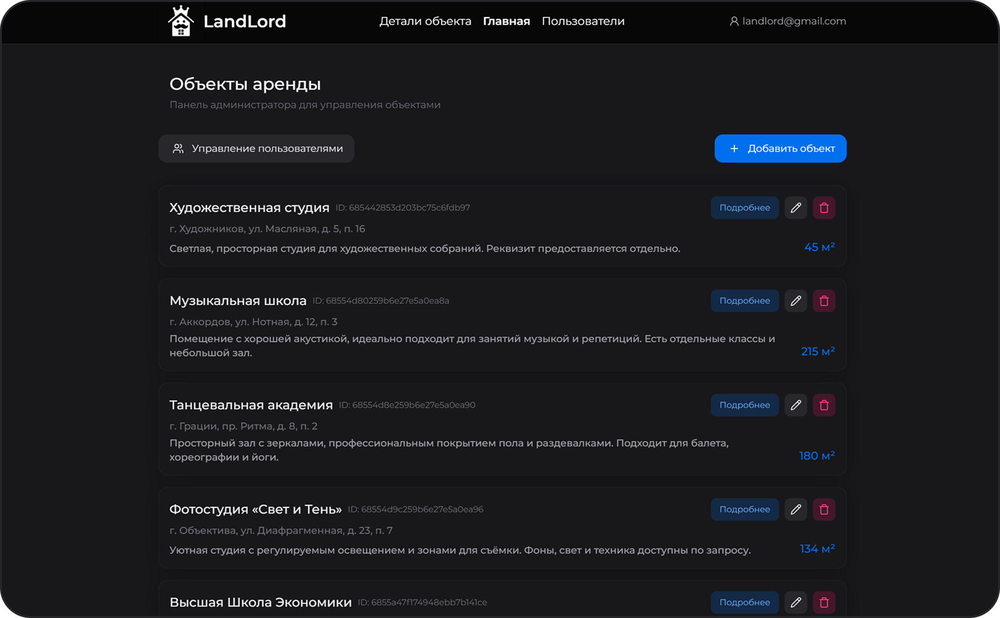
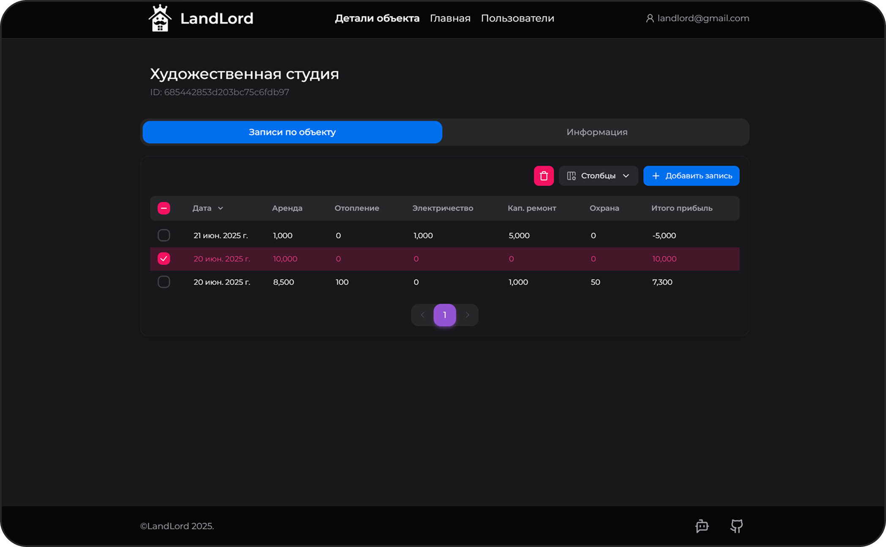
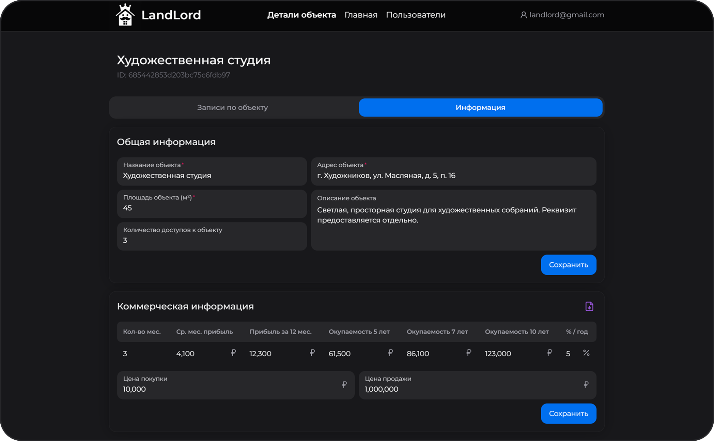
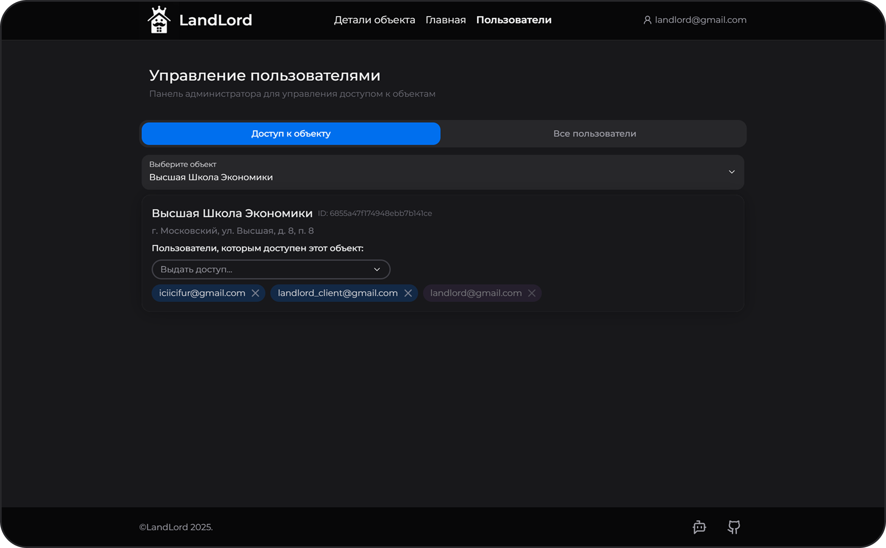

<div>
<h1>LandLord</h1>

<p>
A full-stack Next.js app for commercial real estate cash-flow accounting: track income/expenses by property, manage role-based access, and export XLSX reports.
Built as a practical portfolio project focused on real business use case.
</p>

<a href="https://prettywiki.vercel.app/">
  
</a>
<hr/>

<p>
  <a href="https://www.typescriptlang.org/docs/" target="_blank" rel="noreferrer">
    
  </a>
  <a href="https://nextjs.org/docs" target="_blank" rel="noreferrer">
    
  </a>
  <a href="https://react.dev/" target="_blank" rel="noreferrer">
    
  </a>
  <a href="https://www.mongodb.com/docs/" target="_blank" rel="noreferrer">
    
  </a>
  <a href="https://mobx.js.org/README.html" target="_blank" rel="noreferrer">
    
  </a>
  <a href="https://tailwindcss.com/docs" target="_blank" rel="noreferrer">
    
  </a>
  <a href="https://www.heroui.com/docs" target="_blank" rel="noreferrer">
    
  </a>
  <a href="https://t.me/landlord_assistant_hse_bot">
    
  </a>
</p>
</div>


## 🚀 Deployment and Demo

**Live app**: https://landlord-3zhn.onrender.com/

You may log in as a superuser with following credentials:  
Email: `landlord@gmail.com`  
Password: `1andLordp@ssword`

### Starting the App

To install dependencies, run the following commands from the root directory:

```bash
npm install pnpm
pnpm i
husky init
```

Run the project in dev mode: `pnpm dev`, in production mode:

```bash
pnpm build
pnpm start
```


#### Deploy & Branches

Re-deploy on Render happens on each update of the `master` branch.  
Main development should be done in branches from `develop`, which should stay stable whenever possible.

---

## 💡 The Idea

The app aims to manage income and expenses for commercial real estate objects rented out by a management company.

### Use Scenario
The company receives information about expenses and income and puts this data into the system.  
Then the system performs calculations to support a decision about possible sale of an object to a buyer.

The buyer can view all information for objects they are planning to buy and export data for different periods.

### Main Functionality

- User authorizes by email; **superuser** (administrator) can create accounts for approved emails;
- CRUD operations for objects, data fields, and records
- Flexible data field configuration (add, delete, edit)
- User and access management (object visibility and allowed operations)

### Users

- Client (tenant)
- Administrator (landlord - **superuser**)

#### Client Capabilities

- Sign in with email and password
- View information for objects they have access to (income and expenses only)
- Export information for accessible objects in XLSX format for different periods (from 1 month to full object history)

#### Administrator Capabilities

- Sign in with email and password
- View information for all objects
- View, add, delete, and edit information and fields for all objects
- Add or disable fields for all objects
- Create new objects
- Manage access to objects
- Manage client and manager accounts (add new, delete old)

---

## 🎯 Requirements

**Business expects:**
- A web interface where a manager can add, view, edit, and delete object data.  
Through the same web interface, a client may view object data and export data for custom periods with calculations in XLSX format.

- The interface should support both desktop and mobile devices.

- An admin panel where the **superuser** can manage user access rights and change object accounting structure (add new fields, disable current ones).  
Also can create new objects and delete old ones.

- A Telegram bot through which users can receive an XLSX table with object calculations for a custom period.

- The object page itself should display a table with fields and monthly records.

- Also, if possible, comments for records should be implemented.

---

## ⚙️ App Architecture

### Routes

In Next.js, routing is based on file structure. Current routes:

- `/` - _MainPage_
- `/login` - _Login page_
- `/users` - _Users page_
- `/<object_id>` - _Object's page_
- `/api` - _base route for endpoints_

### Stores

MobX stores are located in folder `/app/stores`.  
These are states shared across all **client-side** parts of the app; client components can observe and modify them.

At the moment, store is used mainly to keep user data.

### Lib

In `/app/lib` we keep common utilities:

- server-only functions (`/actions`),
- app type declarations (`/utils/definitions.ts`),
- data validation schemas (`/utils/zodSchemas.ts`),
- utility functions.

### UI

`/app/ui` is the directory for all **client-side** components.

## 📸 Screenshots

<p>
  
  
  
  
</p>

## 👥 Team
LandLord is developed by a student team as an educational lab.
- **Olesya Dobrovolskaya** — Frontend Developer  
  GitHub: [@IciIcifur](https://github.com/IciIcifur)

- **Maria Petrova** — Backend Developer  
  GitHub: [@MINTCanella](https://github.com/MINTCanella)

- **Egor Astashonok** — Business Consultant, Manager  
  GitHub: [@AEV26](https://github.com/AEV26)

- **Ruslan Sheykh** — TG Bot Developer  
  GitHub: [@sherruka](https://github.com/sherruka)

- **Artem Ovsyannikov** — Frontend Developer  
  GitHub: [@sh1ronchik](https://github.com/sh1ronchik)
